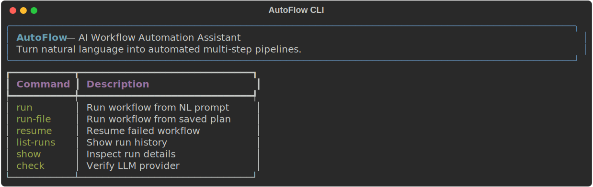
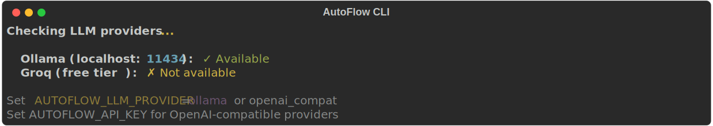
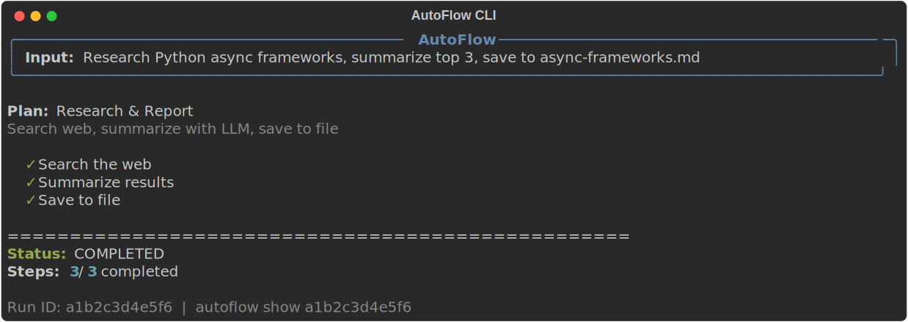
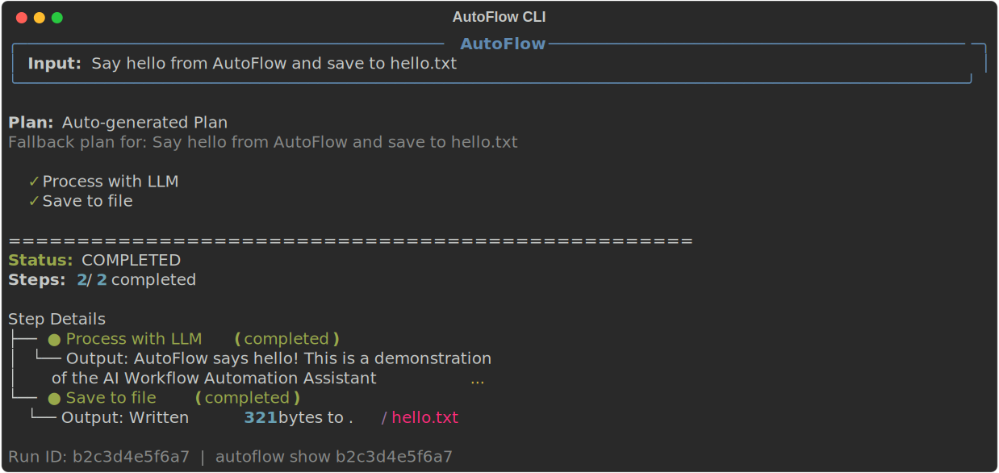
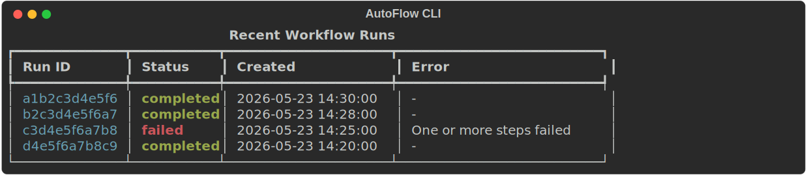
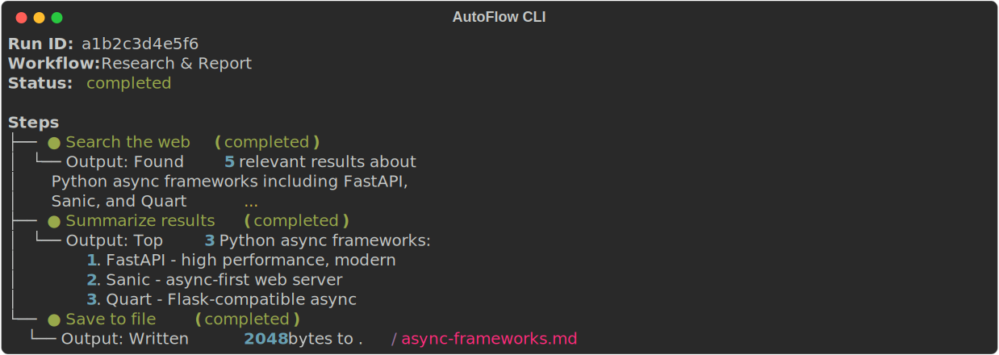
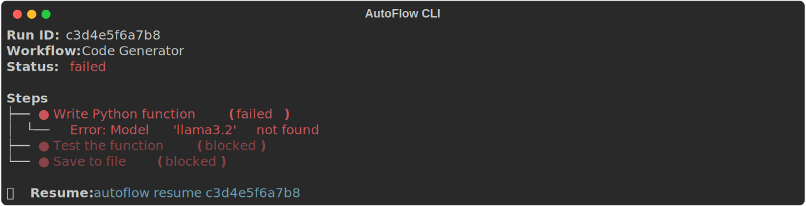
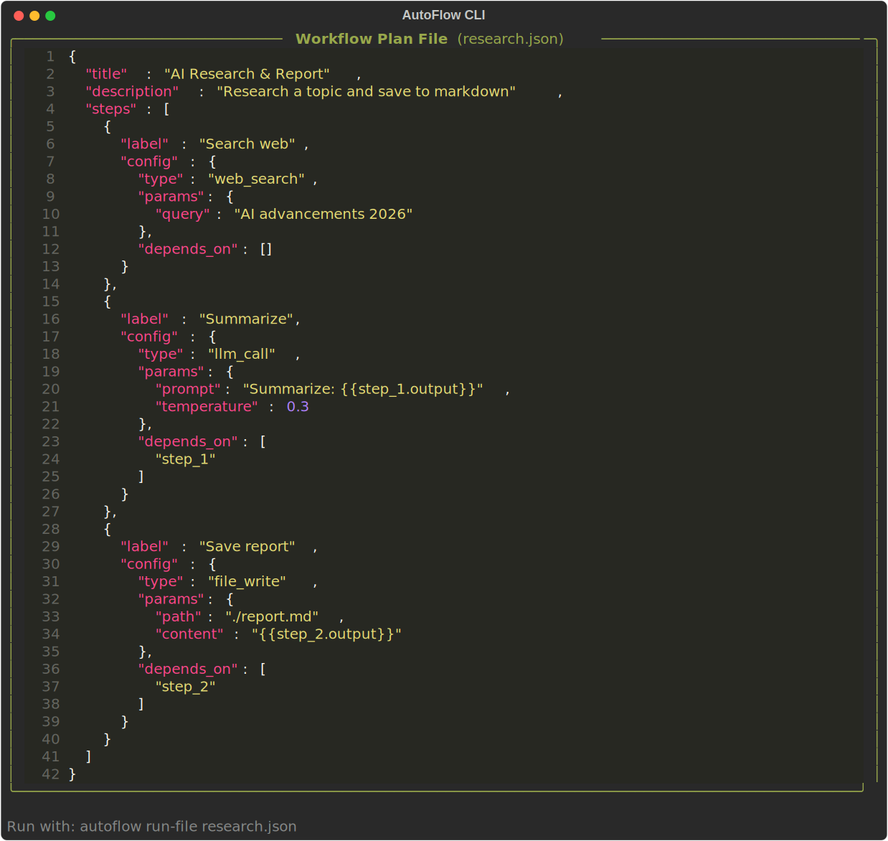

# Screenshots

Visual walkthrough of AutoFlow CLI in action.

---

## 1. CLI Help

```
autoflow --help
```



Shows all 6 commands with descriptions.

---

## 2. Provider Check

```
autoflow check
```



Verifies which LLM providers are available (Ollama local vs cloud APIs).

---

## 3. Running a Workflow

```
autoflow run "Research Python async frameworks, summarize top 3, save to async-frameworks.md"
```



Natural language → planned → executed in a single command.

---

## 4. Verbose Output

```
autoflow run "Say hello from AutoFlow and save to hello.txt" -v
```



The `-v` flag shows per-step output details.

---

## 5. Run History

```
autoflow list-runs
```



All past runs stored in SQLite with status and timestamps.

---

## 6. Run Inspection

```
autoflow show <run-id>
```



Per-step outputs, errors, and timing for any past run.

---

## 7. Failed Run

```
autoflow show <failed-run-id>
```



Shows which step failed, why, and how to resume.

---

## 8. Workflow Plan File

```json
// research.json — define reusable pipelines
```



Declarative workflow templates with DAG dependencies and parameter templating.
